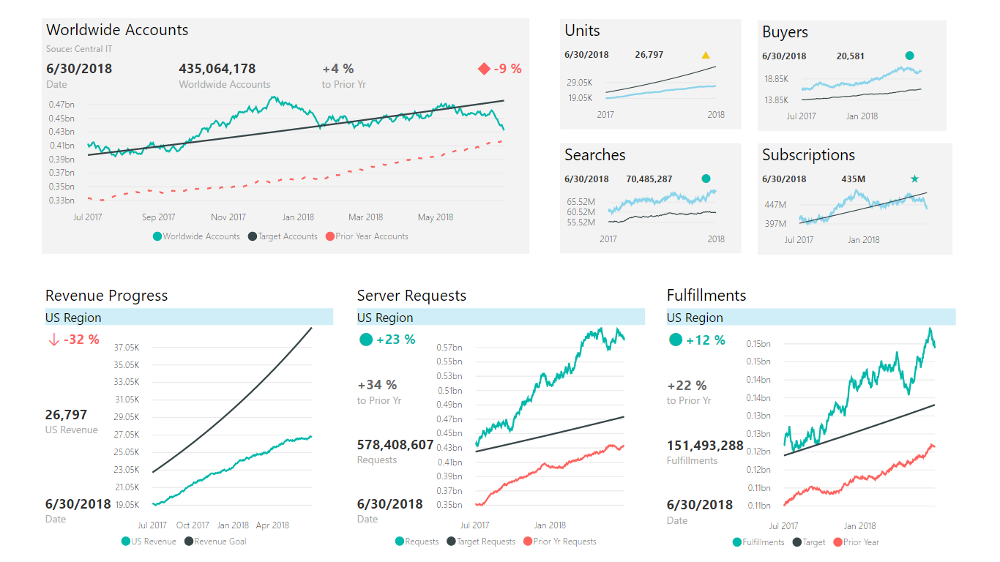

# PowerKPI

> A powerful KPI Indicator with multi-line chart and labels for current date, value and variances.

# Overview  

The Power KPI visual is for presenting a key performance indicator (KPI) along with a variety of supporting information, including:

- Title, Subtitle
- Current date and KPI status (value, indicator symbol, variance)
- Line chart with KPI trend, forecast line, and other comparison lines, as well as tooltips

Some of the key features include:

- KPI Symbols. Circle, triangle, square, diamond, flag, exclamation, checkmark, arrow up/down/angle up/angle/down, caret up/down, circle empty, circle X, circle exclamation, circle checkmark, X, star empty/full. Combine with custom colors.
- Rich Formatting Options. Set alternate titles, labels, and tooltips, font sizes, colors, background colors.
- Layout Options. Toggle all card values on/off and choose among Top/Left/Right/Bottom layouts
- Numerous Chart Features. Provides most of the functionality of the standard line chart visual in Power BI, including customizable data points, number types, precision, X-axis and Y-axis tick marks, labels and reference lines, line styles and thickness, chart legend/location, and hover-over tooltips
- Total Control Over KPI Thresholds. Map your data to the desired KPI Indicators in one of two ways: 1) include a column in your data model with the index number of the symbol; 2) add a calculated column and set your own auto thresholds in the report
- Auto-Scaling. Design a larger tile in your report with rich details. After pinning it to a Power BI Dashboard, you may resize to smaller versions of the tile without losing essential details and without having to create separate report tiles for this purpose.

See also [PowerKPI at Microsoft AppSource](https://appsource.microsoft.com/en-us/product/power-bi-visuals/WA104381763)